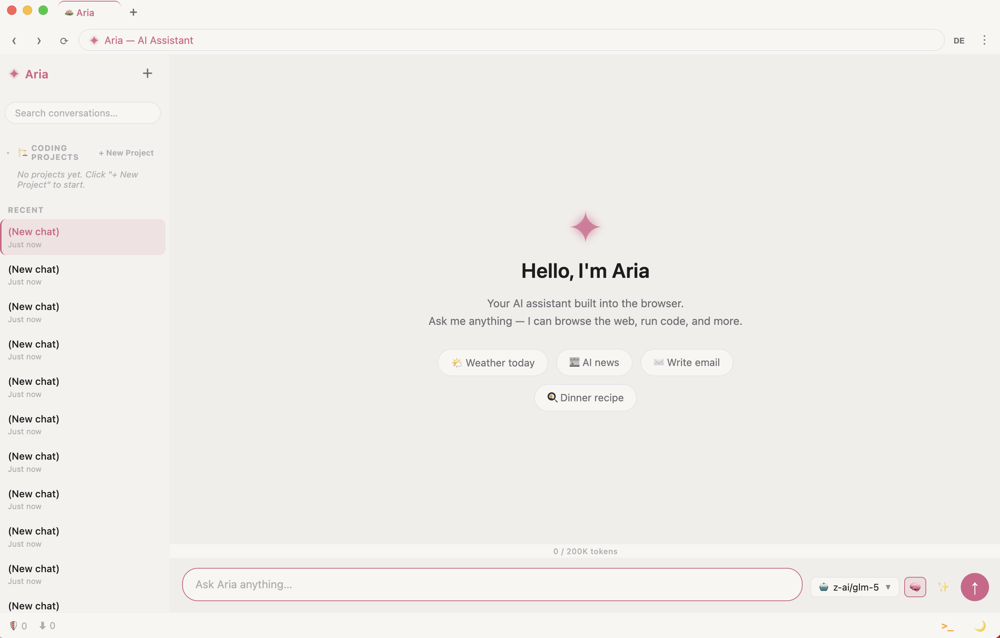
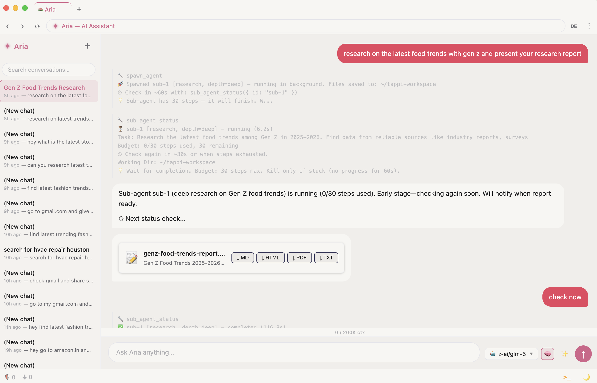
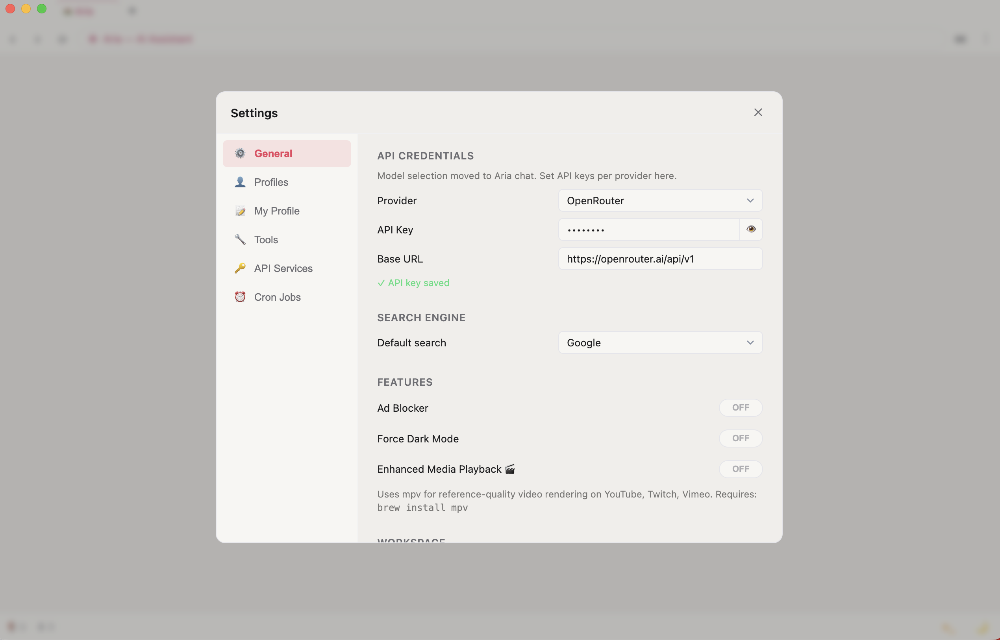

# Tappi Browser

> **The fastest AI browser. Zero telemetry. Open source.**

Tappi is a Chrome-based desktop browser with a built-in AI agent that uses **3-10x fewer tokens** than competitors. No subscription. No cloud lock-in. Bring your own API key.

## Screenshots

| Aria Agent | Real Conversation |
|------------|-------------------|
|  |  |

| Normal Browsing | Settings |
|-----------------|----------|
|  |  |

---

## Why Tappi?

| | Tappi | Perplexity Comet | ChatGPT Atlas |
|---|---|---|---|
| **Token Efficiency** | ✅ 3-10x savings | Standard | Standard |
| **Telemetry** | ❌ Zero | ✅ Full | ✅ Full |
| **Open Source** | ✅ Yes | ❌ No | ❌ No |
| **Subscription** | ❌ None | $20-200/mo | $20-200/mo |
| **BYOK** | ✅ 8+ providers | ❌ Locked | ❌ Locked |
| **Shell Access** | ✅ Full | ❌ No | ❌ No |
| **Parallel Agents** | ✅ Yes | ❌ No | ❌ Limited |

**The Comet problem:** The Verge found that Perplexity's Comet took *two minutes* to unsubscribe from emails - a task a human could do in 30 seconds. That's not automation. That's theater.

**Tappi is different.** Our referenced element indexing means click commands like `click e42` instead of 500-token DOM selectors. We aggressively write context to disk and let you grep it on demand. The result: genuinely faster automation that costs less to run.

---

## How It Works

### Referenced Element Indexing

Most AI browsers dump entire DOM trees into the LLM context - 50KB of HTML, 12,500+ tokens, just to "see" the page.

Tappi indexes elements once and the agent references them by ID internally. When you ask *"Find the best price for this product"*, the agent:
1. Indexes interactive elements on the page
2. Identifies search boxes, buttons, links by their indexed IDs
3. Executes clicks and types using compact references like `click e42`

**Result:** 3-10x fewer tokens than DOM-dumping approaches.

### Aggressive Context Management

Long conversations get written to disk. The agent greps files instead of loading them:

```
Agent: "I found the function in conversation-turn-47.md - grep shows it's on line 234"
```

Load full files when needed (up to 10K tokens). Otherwise: grep first, load later.

### Native Browser Automation

Tappi uses Chrome DevTools Protocol (CDP) directly - not Selenium, not Puppeteer. The automation *is* the browser. No fingerprinting possible because there's nothing to detect.

---

## What Can You Do?

Everything Comet and Atlas can do - plus what they can't:

**Core Browsing:**
- Research and summarize any page
- Fill forms, complete workflows, book reservations
- Shop, compare products, find best prices
- Manage tabs, bookmarks, downloads
- Schedule recurring tasks with cron
- Take screenshots and record tabs

**Developer Power:**
- Code with multi-agent teams (parallel spawning)
- Run shell commands from the agent
- Control via CLI or HTTP API
- Self-host, zero cloud dependency

---

## Quick Start

### 1. Clone and build

```bash
git clone https://github.com/shaihazher/tappi-browser.git
cd tappi-browser
npm install
npm run build
```

### 2. Launch

```bash
npx electron dist/main.js
```

### 3. Add your API key

Press `⌘,` (macOS) or `Ctrl+,` (Windows/Linux) to open Settings. Choose your provider, paste your API key, pick a model, and save.

### 4. Browse and talk to Aria

- Open tabs with `⌘T` / `Ctrl+T`
- Press `⌘J` / `Ctrl+J` to open the AI agent panel
- Or click the **Aria** tab (always first) for full-width chat

---

## Supported LLM Providers

Bring your own key. No lock-in.

| Provider | Auth | Models |
|----------|------|--------|
| **Anthropic** | API key | Claude Opus 4.6, Sonnet 4.6, Haiku 4.5 |
| **OpenAI** | API key | GPT-5.2, o3, o4, GPT-4o |
| **Google Gemini** | API key | Gemini 2.5 Pro, 2.0 Flash |
| **OpenRouter** | API key | 100+ models, single key |
| **Ollama** | None (local) | llama3.1, mistral, gemma, etc. |
| **AWS Bedrock** | IAM | Claude, Titan, Llama via AWS |
| **Vertex AI** | Google ADC | Gemini models via GCP |
| **Azure OpenAI** | Endpoint + key | GPT deployments |

---

## Recommended Models

| Use Case | Model | Why |
|----------|-------|-----|
| **Safety-first** | Claude Opus 4.6 | Best reasoning, lowest hallucination |
| **Best value** | GLM-5 (OpenRouter) | Excellent price/performance ratio |
| **Speed** | Grok 4.1 Fast | Fast, cheap, surprisingly capable |
| **Coding** | Codex 5.3 | Optimized for code generation |
| **Free** | Ollama (local) | Runs on your hardware, zero cost |

The agent harness works well with inexpensive models - you don't need Opus for most tasks.

---

## CLI & API: Control Tappi From Anywhere

Tappi ships with a **local HTTP API** and a **CLI** that wraps it. Automate the browser from your terminal, scripts, or any HTTP client.

### Enable Developer Mode

In Settings, toggle **Developer Mode** to unlock shell access and the full tool suite.

### Using the CLI

```bash
# List all tabs
tappi-browser tabs

# Navigate
tappi-browser open https://github.com

# Index page elements
tappi-browser elements

# Click and type
tappi-browser click 3
tappi-browser type 3 "hello world"

# Ask the AI agent
tappi-browser ask "Summarize this page"

# Stream responses
tappi-browser ask --stream "What's the main point?"

# Run shell commands (dev mode)
tappi-browser exec "ls ~/Downloads"

# Get/set config
tappi-browser config get
tappi-browser config set developerMode true
```

### Using the HTTP API

The API runs on `http://127.0.0.1:18901`. Authentication uses a Bearer token stored at `~/.tappi-browser/api-token`.

```bash
# Get API token
TOKEN=$(cat ~/.tappi-browser/api-token)

# Check status
curl -H "Authorization: Bearer $TOKEN" \
  http://127.0.0.1:18901/api/status

# Open a tab
curl -X POST \
  -H "Authorization: Bearer $TOKEN" \
  -H "Content-Type: application/json" \
  -d '{"url": "https://github.com"}' \
  http://127.0.0.1:18901/api/tabs

# Ask the agent
curl -X POST \
  -H "Authorization: Bearer $TOKEN" \
  -H "Content-Type: application/json" \
  -d '{"message": "What is on this page?"}' \
  http://127.0.0.1:18901/api/agent/ask

# Stream agent responses (SSE)
curl -N \
  -H "Authorization: Bearer $TOKEN" \
  -H "Content-Type: application/json" \
  -d '{"message": "Explain the code on screen"}' \
  http://127.0.0.1:18901/api/agent/ask/stream
```

### Full Documentation

| Doc | Description |
|-----|-------------|
| [API Overview](docs/api/overview.md) | REST API concepts, auth, rate limits |
| [API Endpoints](docs/api/endpoints.md) | Every endpoint documented |
| [SSE Streaming](docs/api/sse-streaming.md) | Real-time agent responses |
| [Tool Passthrough](docs/api/tool-passthrough.md) | Invoke any tool via API |
| [CLI Overview](docs/cli/overview.md) | Command-line interface guide |
| [CLI Commands](docs/cli/commands.md) | Every command documented |
| [CLI Scripting](docs/cli/scripting.md) | Automation, jq, pipes |

---

## Developer Mode

Toggle **Developer Mode** in Settings to unlock:

- **Shell access** - agent can run `exec` commands
- **Full filesystem** - read/write any file on your machine
- **Unrestricted tools** - all 47+ tools available

This turns Tappi into something like OpenClaw running natively inside a browser. Use responsibly.

---

## Platform Support

| Platform | Status |
|----------|--------|
| macOS (Apple Silicon) | ✅ Available |
| macOS (Intel) | ✅ Available |
| Windows | 🔜 Coming soon |
| Linux | 🔜 Coming soon |

The CLI and API work identically across all platforms.

---

## Keyboard Shortcuts

| Action | macOS | Windows/Linux |
|--------|-------|---------------|
| Open Settings | `⌘,` | `Ctrl+,` |
| New Tab | `⌘T` | `Ctrl+T` |
| Close Tab | `⌘W` | `Ctrl+W` |
| Agent Panel | `⌘J` | `Ctrl+J` |
| Find in Page | `⌘F` | `Ctrl+F` |
| Dark Mode | `⌘D` | `Ctrl+D` |

---

## Open Source, Community-Driven

We have no VC funding. No board demanding growth metrics. No advertising business model to protect.

This is a **work of passion** - built because we wanted an AI browser that actually works, doesn't spy on us, and doesn't cost a fortune.

**Contributions welcome.** File issues, submit PRs, join the conversation.

- **GitHub:** [github.com/shaihazher/tappi-browser](https://github.com/shaihazher/tappi-browser)
- **Issues:** [github.com/shaihazher/tappi-browser/issues](https://github.com/shaihazher/tappi-browser/issues)

---

## License

MIT License. Use it, fork it, ship it.

---

## Documentation Index

| Guide | Description |
|-------|-------------|
| [Getting Started](docs/user-guide/getting-started.md) | Build, first-run, first conversation |
| [Browsing](docs/user-guide/browsing.md) | Tabs, navigation, bookmarks, dark mode |
| [AI Agent (Aria)](docs/user-guide/agent.md) | Agent panel, deep mode, tools |
| [Browser Profiles](docs/user-guide/profiles.md) | Create, switch, export/import |
| [Media Playback](docs/user-guide/media.md) | mpv overlay, YouTube enhancement |
| [Settings](docs/user-guide/settings.md) | All configuration options |
| [Keyboard Shortcuts](docs/user-guide/keyboard-shortcuts.md) | Complete reference |
| [Privacy & Security](docs/user-guide/privacy-security.md) | Local storage, encryption, BYOK |
| [Changelog](docs/changelog.md) | Release history |

---

Made with 🪷 by people who just wanted a faster browser.
