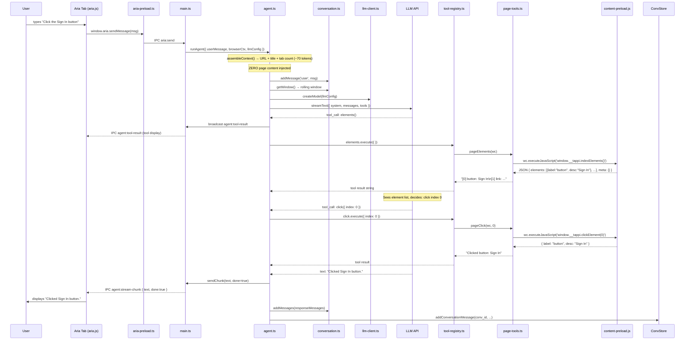
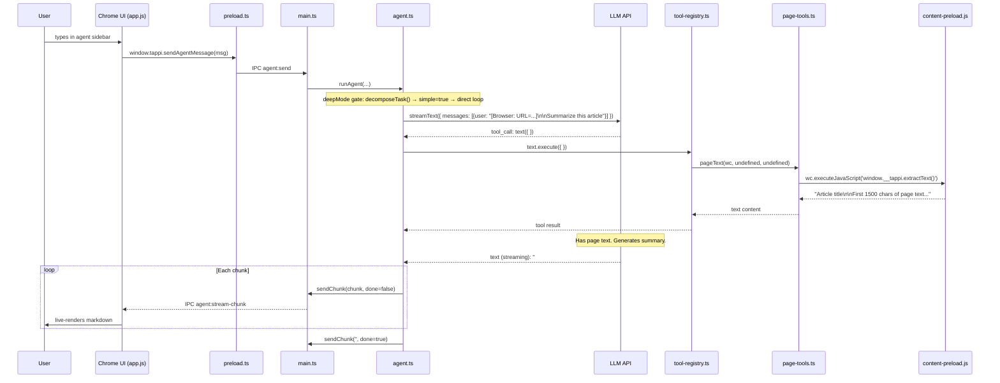
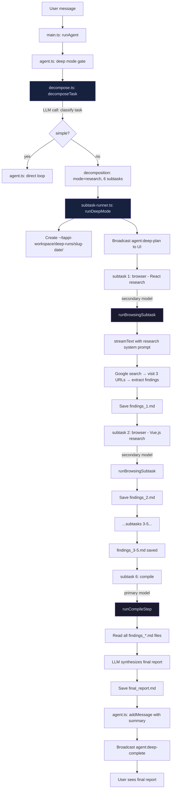
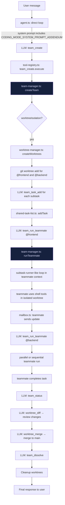
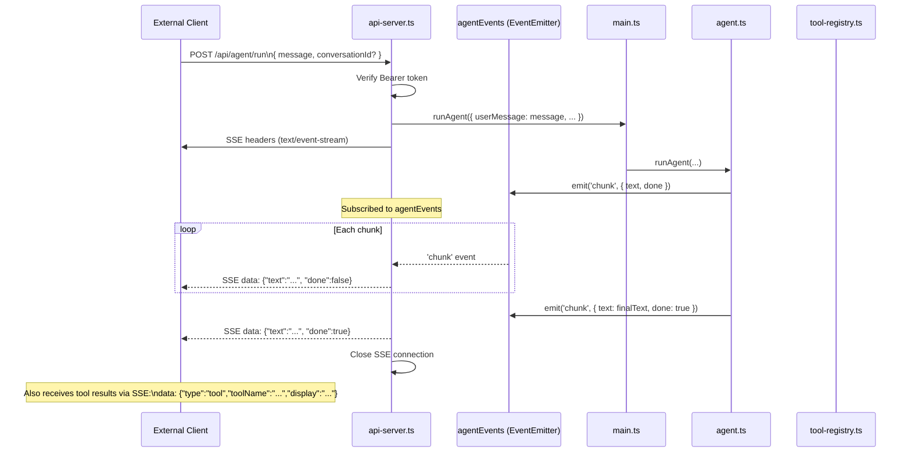
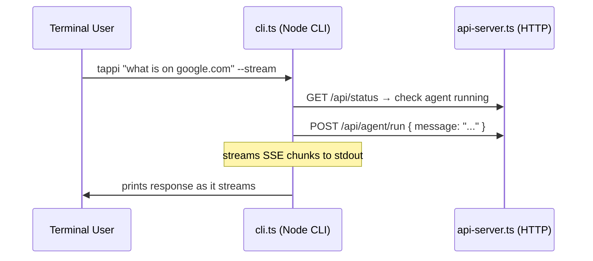
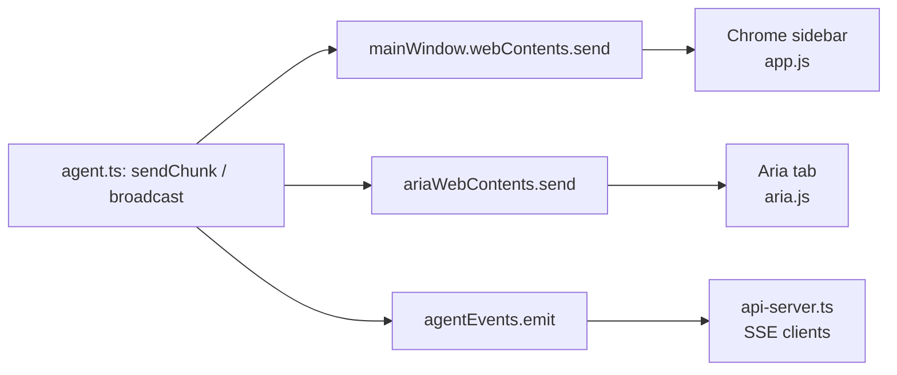

# Data Flow Diagrams

End-to-end flows for the five key scenarios. File annotations show which source file handles each step.

---

## 1. User Asks Agent to Click a Button

> "Click the Sign In button"

**Files involved:** `aria.js` → `aria-preload.ts` → `main.ts` → `agent.ts` → `conversation.ts` → `llm-client.ts` → `tool-registry.ts` → `page-tools.ts` → `content-preload.js`

---

## 2. User Asks Agent to Summarize Page Text

> "Summarize this article"

**Files involved:** `app.js` → `preload.ts` → `main.ts` → `agent.ts` → `tool-registry.ts` → `page-tools.ts` → `content-preload.js`

---

## 3. Deep Mode Task Decomposition

> "Research the top 5 JavaScript frameworks and compare them"

**Key files:**
- `agent.ts` — deep mode gate, decomposeTask call, final message persistence
- `decompose.ts` — prompt construction, JSON parsing, `DecompositionResult`
- `subtask-runner.ts` — sequential execution, file I/O, progress events
- `llm-client.ts` — `getModelConfig('secondary')` for execution, primary for compile

**IPC events emitted:**
- `agent:deep-plan` — full plan with all subtask descriptions
- `agent:deep-subtask-start` — per subtask on start
- `agent:deep-stream-chunk` — streaming text per subtask
- `agent:deep-tool-result` — per tool call inside subtask
- `agent:deep-subtask-done` — per subtask on complete/fail
- `agent:deep-complete` — final summary

---

## 4. Coding Mode Team Task

> "Add a dark mode toggle to the settings page" (Coding Mode on)

**Key files:**
- `agent.ts` — orchestrator runs in normal loop, uses team tools
- `tool-registry.ts` — team tools: `team_create`, `team_task_add`, `team_run_teammate`, `team_status`, `team_message`, `team_dissolve`
- `team-manager.ts` — team state, teammate execution (each teammate is a mini-agent loop)
- `worktree-manager.ts` — `git worktree add` per teammate, diff, merge, cleanup
- `shared-task-list.ts` — task queue shared between orchestrator and teammates
- `mailbox.ts` — async message passing between orchestrator and teammates

---

## 5. API / CLI External Request

> HTTP `POST /api/agent/run` with `{ "message": "check the weather" }` (Developer Mode)

**CLI usage** (`src/cli.ts`):

**Key files:**
- `api-server.ts` — Express server, Bearer token auth, `/api/agent/run` (SSE), `/api/status`, `/api/tabs`, `/api/navigate`, `/api/screenshot`
- `cli.ts` — Node.js CLI that POSTs to the local API server
- `agent.ts` — `agentEvents` EventEmitter (module-level) bridging agent to API

**Developer Mode guard:** The HTTP API server only starts when `currentConfig.developerMode === true`. Toggling it via the UI (`devmode:set` IPC) calls `startApiServer()` or `stopApiServer()` live.

---

## Cross-Cutting: IPC Event Fan-out

Agent output is always broadcast to **both** the chrome UI and the Aria tab:

This means a message typed in the sidebar is visible in Aria tab's stream, and vice versa. Both UIs stay in sync for the current active conversation.

---

## Related Docs

- [Overview](overview.md)
- [Agent System](agent-system.md)
- [Indexer](indexer.md)
- [Electron Structure](electron-structure.md)
- [Source Map](../source-map/files.md)
