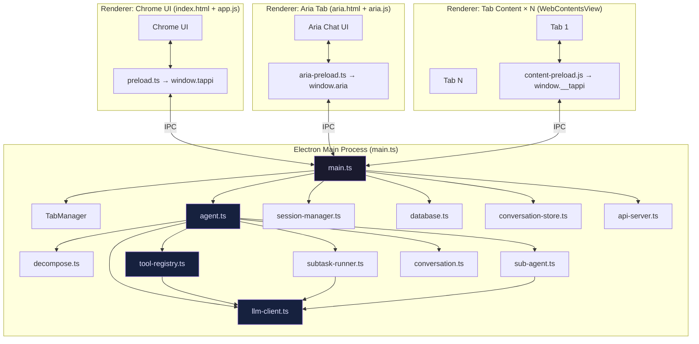

# Tappi Browser — Architecture Overview

Tappi is a **standalone Electron-based desktop browser with a built-in AI agent**. The agent controls the browser through typed tool calls rather than through free-form text commands. Every tab hosts a full rendering engine; a sidebar panel (or a dedicated "Aria" tab) is the agent's chat surface.

---

## High-Level Diagram



---

## Process Boundary

| Layer | File(s) | Runs In |
|-------|---------|---------|
| Main process | `main.ts`, `agent.ts`, `tab-manager.ts`, all `.ts` src files | Node.js / Electron main |
| Chrome UI renderer | `ui/index.html`, `ui/app.js`, `ui/styles.css` | Renderer (sandboxed) |
| Aria tab renderer | `ui/aria.html`, `ui/aria.js`, `ui/aria.css` | Renderer (sandbox=false for IPC) |
| Tab renderers | Web content + `content-preload.js` | Renderer (sandboxed, contextIsolation=true) |
| Bridge (chrome) | `preload.ts` → `window.tappi` | Preload (context-isolated) |
| Bridge (aria) | `aria-preload.ts` → `window.aria` | Preload (context-isolated) |
| Bridge (tabs) | `content-preload.js` → `window.__tappi` | Preload (context-isolated) |

IPC is the **only** communication path between renderers and main. No shared memory. No Node.js in sandboxed renderers.

---

## Key Architectural Decisions

### Why Electron?
Electron gives Tappi a full Chromium rendering engine (meaning real-world site compatibility including complex SPAs, shadow DOM components, and video players) while keeping all agent logic in a Node.js main process with unrestricted file system, shell, and HTTP access. Building on top of a browser engine avoids having to ship a separate webview component.

### WebContentsView (not BrowserView)
Tappi uses `WebContentsView` — the modern Electron API — rather than the deprecated `BrowserView`. Each tab is a `WebContentsView` child of the main window's `contentView`. Only the active tab's view is added to the view hierarchy at any time; inactive views are removed to prevent z-order bleed.

### Tool Calling over Text Commands
The agent interacts with the browser exclusively through **Vercel AI SDK tool calls** (`streamText` with a `tools` map). The LLM declares *what* to do (call `elements`, `click`, `type`…) and the main process executes it. This is more reliable than parsing free-form commands: the SDK enforces argument schemas (via Zod), handles multi-step loops, and provides structured tool results that go back into the LLM's context.

### The Indexer Philosophy — Compact Indexed Menus
Most AI browsers expose the **accessibility tree** or raw DOM to the LLM. Tappi does neither.

`content-preload.js` walks the DOM looking for a curated set of **interactive selectors** (`a[href]`, `button`, `input`, `select`, `textarea`, ARIA roles…). It pierces shadow DOM recursively, applies viewport scoping (only elements visible on-screen are indexed by default), deduplicates by label+description, and emits a **compact indexed list** — typically 20–40 items — like:

```
[0] button: Sign in
[1] input:text: Email → user@example.com
[2] link: Forgot password → https://example.com/reset
```

Each element gets a `data-tappi-idx` stamp so subsequent `click(0)`, `type(1, "…")` calls can find it reliably even in shadow DOM.

Benefits vs. accessibility trees / full DOM:
- **10–50× fewer tokens** per page call
- **No hallucinated elements** — the agent can only reference what actually exists
- **grep-first** — `elements({ grep: "checkout" })` searches *all* elements (offscreen too) before the agent even considers scrolling
- **Stable** — works on any web technology: React, Vue, Svelte, Web Components

### Zero Page Content in Context
The agent's `assembleContext()` function injects **only browser state** (current URL, title, open tab count) per turn — never page content. The LLM must call `elements()` or `text()` when it wants to see the page. This keeps the base context tiny (~70 tokens) and forces purposeful, targeted page reads.

### Primary + Secondary Models
Tappi supports a **primary model** (full capability, thinking enabled) and an optional **secondary model** (cheaper/faster, thinking off). The secondary model is used for:
- Deep mode execution subtasks
- Sub-agents (spawned workers)
- Eviction summaries (compressing conversation history)
- User profile generation

The compile step in research deep mode always uses the primary model because it requires full synthesis capability.

---

## Related Docs

- [Electron Structure](electron-structure.md)
- [Agent System](agent-system.md)
- [Indexer](indexer.md)
- [Data Flow](data-flow.md)
- [Source Map](../source-map/files.md)
